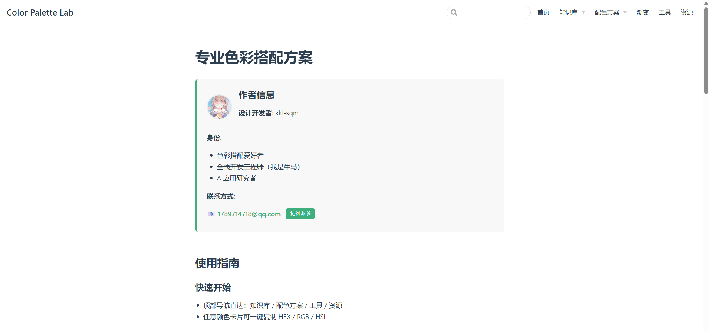
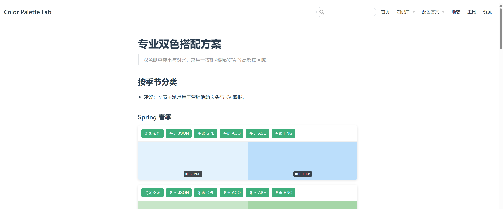
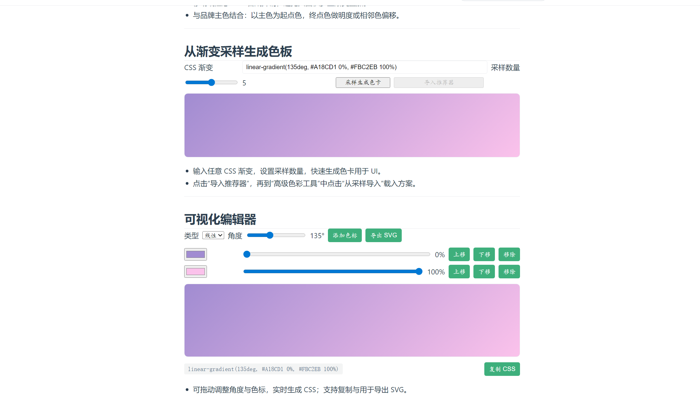
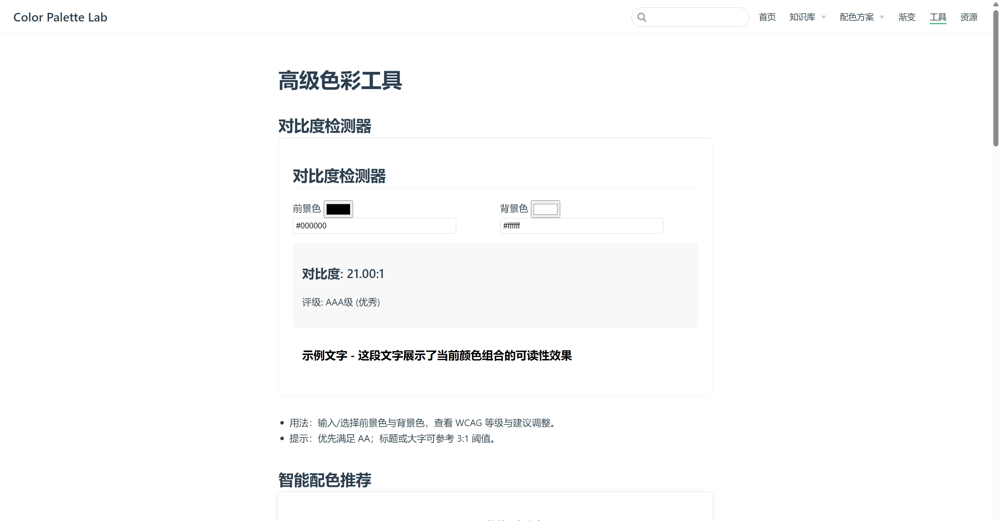

# Color Palette Lab

一个基于 VuePress 构建的专业配色与渐变素材站点，聚焦色彩方案管理、可访问性校验与工程化导出。

## 功能亮点
- 配色方案库：2/3/4 色示例与品牌落地占位
- 高级工具：对比度检测、色盲模拟、图片取色、智能配色推荐
- 渐变中心：线性/径向/玻璃态示例，可视化编辑、从渐变采样生成色卡
- 导出生态：JSON / GPL / ACO / ASE / CSS / SCSS / LESS / Tailwind / Style Dictionary，支持打包 Zip
- 协作能力：URL 短链接分享、收藏与导入导出 JSON

## 快速开始
```bash
# 安装依赖
npm install

# 本地开发
npm run dev

# 构建静态站点
npm run build
```

## 目录结构
- docs/.vuepress/components：站点自定义组件（配色卡、工具、渐变等）
- docs/：文档与页面（首页、知识库、配色方案、渐变、资源等）

## 截图与示例
- 渐变编辑器、智能推荐、对比度检测等功能可在对应页面直接体验








## 作者
- GitHub：[@Sqm-Zero](https://github.com/Sqm-Zero)
- 博客：[@iku_n · CSDN](https://blog.csdn.net/iku_n?type=blog)

## 许可证
本项目仅用于学习与展示目的；如需在生产环境使用，请根据实际需求做安全与合规评估。
